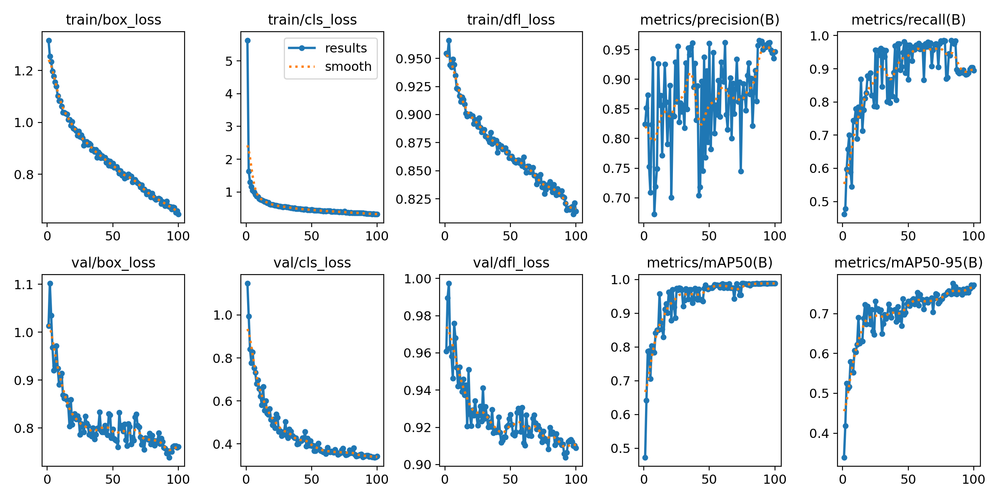
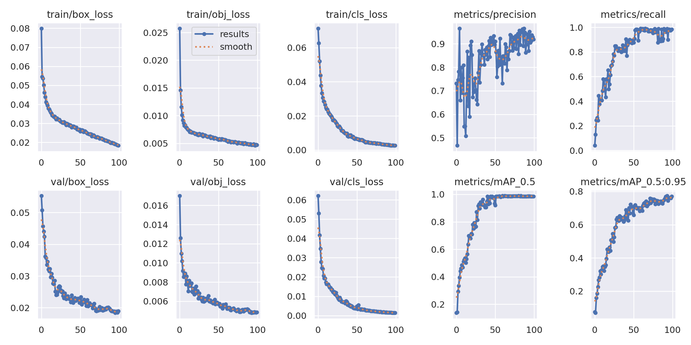
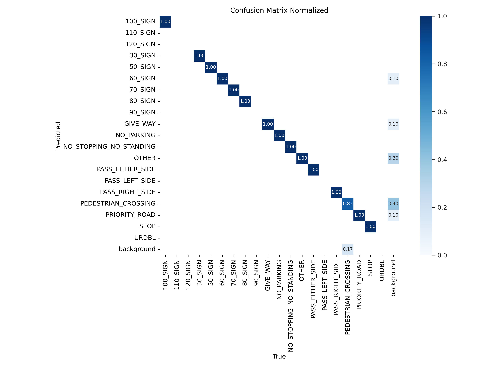

# Глубокое обучение на практике
## Что было сделано?
### Задача
Создать прототип помощника для водителей, который будет оповещать их о дорожных знаках.
### Данные 
Не предоставлены данные для обучения модели. Соответственно их необходимо было найти. Был выбран [датасет](https://www.cvl.isy.liu.se/en/research/datasets/traffic-signs-dataset/). Далее возникла проблема, YOLO требует специальной аннотации, которая не совпадала с аннотацией нашего датасета. Поэтому было принято решение, написать скрипт, который трансформирует одну аннотацию в другую (`parsing.py`). Таким образом получилось собрать 4т. размеченных изображений, на 2.8т из которых был хотя бы 1 знак.

### Модель
Была выбрана модель `YOLO` т.к. задача декомпозируется на детекцию и классификацию, а это как раз проблема которую решает `YOLO`. Это простая в использовании модель и до недавнего времени `YOLO` демонстрировала SOTA результаты в своей сфере.
Было выбрано две модели для тестирования `YOLOv5s`, `YOLOv8s`.


Из графиков видно, при примерно одинаковый размерах и скорости работы, `YOLOv8s` демонстрирует более высокие показатели `mAP50-95`. Для проверки данного утверждения мы решили обучить обе модели на одинаковом датасете. Результаты обучения вы можете видеть в разделе с метриками.

### Подбор гиперпараметров
Фреймы видео представляют из себя изображения, дорожные знаки на которых могут занимать малую часть изображения. В связи с чем главным гиперпараметром является размер входного изображения. В первую очередь данный параметр `imgsz` был выбран равным `320`. При таких размерах изображения знаки на видео преобразуются в еще маньшее количество пикселей, как результат, детекция была хаотичной, модель часто ошибалась в классификации и даже детектировала с высокой уверенностью знаки, которых нет. Было решено увеличить размер входного изображения до `480`, это не привело к увеличению качества результата. Следующим шагом был выбран `imgsz=960`, что сильно увеличило качество детекции. К сожалению такой большой размер входного изображения требует большого количества ресурсов, поэтому пришлось уменьшить `batch` (размер пакета) до 4, что сильно замедлило скорость обучения. Например, модель yolo8s обучалась 4 часа, и за это время успело пройти 100 эпох.

### Валидационная выборка
Поскольку мы обладали сравнительно небольшим набором данных шведских знаков, валидационную выборку было решено выделить вручную по двум причинам:
1) валидационная выборка должна быть небольшой, имея всего 2800 изображений с дорожными знаками нет никакого желания уменьшать тренировочную выборку еще сильнее, таким образом было набрано лишь 50 изображений для валидации
2) набирая изображения вручную, у нас была возможность отобрать их таким образом, чтобы эта тестовая выборка была репрезентативна и стратифицирована по классам. Часто выбирались изображения с большим количеством дорожных знаков. Например, для знаков пешеходного перехода, который в датасете больше всего, было набрано больше изображения, это дает возможность оценить точность распознавания.

Краткое описание полученной валидационной выборки: 50 изображений, 80 объектов на изображениях, 14 фоновых изображений (без знаков).

Результаты подобного подхода мы обсудим в разделе с выбором модели.

### Метрики
`mAP50` и `mAP50-95` - это метрики, используемые для оценки качества работы моделей объектного обнаружения (`object detection`) в компьютерном зрении. Обе метрики связаны с метрикой средней точности обнаружения (mean Average Precision, mAP), но с различными параметрами для расчета.

`IoU` (Intersection over Union) - это мера, используемая для измерения степени перекрытия между предсказанным объектом и истинным объектом в данных обнаружения объектов.

`mAP50` (mean Average Precision at 50 IoU):
измеряет среднюю точность обнаружения при пороге IoU в 50%. Таким образом, предсказанный объект считается верно обнаруженным, если IoU больше 0.5.

`mAP50-95` (mean Average Precision from 50 to 95 IoU):
эта метрика учитывает среднюю точность обнаружения в диапазоне порогов IoU от 50% до 95% с шагом 5%. Таким образом, она более полно оценивает производительность модели в различных уровнях перекрытия объектов.

Графики обучения и валидации `YOLOv8s`:


Графики обучения и валидации `YOLOv5s`:


Видим, что обе модели не переобучились. Оценим матрицу ошибок на валидационной части датасета. Модели демонстрируют примерно одинаковый результат. `YOLOv8` чуть более лучший результат. Первое изображение v8, второе v5.




Также проводилась человеческая оценка качества работы модели на видео с видеорегистратора в режиме реального времени. Для этого использовались `yolo_test.ipynb`, `yolo8_test.ipynb`. 

Видео с работой моделей вы можете найти по ссылкам:

[YOLOv5s](https://youtu.be/MBlS5E19TxM)

[YOLOv8s](https://youtu.be/X7MT9XkDZU0)

Мы видим, что детекция 5-ой модели гораздо более хаотичная. Модель детектирует несуществующие знаки, модель неправильно классифицирует существующие. Из видео с 8-ой моделью видно, что она справляется с задачей гораздо лучше.


### Выбор модели 
Работа с численными метриками говорит нам о том, что модели очень похожи, хотя `YOLOv8s` демонстрирует немного более высокие результаты, но решающую роль, кончено, играет человеческая оценка. По видео приведенным в разделе с метриками можно увидеть, что `YOLOv8s` справляется с задачей гораздо лучше. В дальнейшем будем использовать 8-ую версию.


### Результат
Видео для быстрой оценки полученного результата:

[YOLOv5s](https://youtu.be/MBlS5E19TxM)

[YOLOv8s](https://youtu.be/X7MT9XkDZU0)

 `YOLOv5s` научилась успешно распознавать популярные знаки на дороге. На видео мы можем увидеть: `GIVE_WAY` - уступи дорогу, `PEDESTRIANS_CROSSING` - пешеходный переход, или осторожно пешеходы, `PRIORITY_ROAD` - главная дорога.

 `YOLOv8s` работает гораздо лучше, испытывает проблемы только со знаками находящимися на большом расстоянии, при подъезде к этим знакам отлично справляется с классификацией. Также испытывает проблемы с похожими знаками, например, ограничение скорости 30 и 50. Также модель пропускает знаки класса OTHER, думаю это связано с тем, что в используемой разметке данным классом были размечены знаки не относящиеся к уже имеющимся классам.

 Лучшие из полученных результатов для моделей вы можете найти в `models`. Чтобы оценить работоспособность, вы можете использовать консольную команду.

 `YOLOv5s`
 ```
python3 notebooks/show_5s.py models/100e_yolo5s.pt data/day_alot.mp4
 ```
 `YOLOv8s`
 ```
python3 notebooks/show_8s.py models/100e_yolo8s.pt data/day_alot.mp4
 ```
 Обратите, внимание файл day_alot.mp4 вы можете взять из наших данных по ссылке ниже (раздел "обучение на вашем датасете")
 
 Также для проверки работы вы можете воспользоваться ноутбуками `yolo_test.ipynb`, `yolo8_test.ipynb` и `frame_test.ipynb`.
 Проверить качество разметки можно с помощью файла `boundbox.py`.

## Установка
### Организуем виртуальное окружение проекта
В корневой папке вашего репозитория выполните:
```
python3 -m venv venv
. venv/bin/activate
```

### Клонируем репозиторий с YOLO (только для версии v5)
В корневой папке вашего репозитория выполните:
```
git clone https://github.com/ultralytics/yolov5
cd yolo5
pip install -r requirements.txt
```
Далее нужно установить необходимые библиотеки для остальных файлов репозитория. Выполняем следующую команду из корня данного репозитория:
```
pip install -r requirements.txt
```

### Обучение на вашем датасете для YOLOv5
Наши данные вы можете скачать по [ссылке](https://disk.yandex.ru/d/yLcFb1zlbjQQiw). Данный архив нужно распоковать в корневую директорию данного репозитория.

Для обучения на собственном датасете необходимо создать файл `dataset.yaml`. Этот файл должен отвечать определенным требованиям, которые вы можете увидеть по [ссылке](https://docs.ultralytics.com/yolov5/tutorials/train_custom_data/#11-create-datasetyaml). Я расположил данный файл в `notebooks/`.
Перед запуском обучения необходимо загрузить веса для дообучения.
```
python3
>>> import torch
>>> torch.hub.load('ultralytics/yolov5', 'yolov5s')
```
Чтобы запустить процесс обучения необходимо выполнить следующую консольную команду.
```
python3 yolov5/train.py --img 960 --batch 4 --epochs 20 --data notebooks/dataset.yaml --weights yolov5s.pt
```
Таким же образом можно дообучить вашу модель, просто поменяв путь до файла, например:
```
python3 yolov5/train.py --img 960 --batch 4 --epochs 20 --data notebooks/dataset.yaml --weights /yolov5/runs/train/exp/weights/last.pt
```

### В случае YOLOv8
Будет удобнее воспользоваться `Python API`.
Подробности можно увидеть в файле `train_yolo8.py`.

## Оценка производительности модели YOLOv8s
### Скорость
Данные были получены с помощью `validate_yolo8.py`.

Speed: 8.0ms preprocess, 24.6ms inference, 0.0ms loss, 10.4ms postprocess per image

`Preprocess` (Предварительная обработка): 8.0 миллисекунд на изображение
    Этот этап включает в себя все операции, которые выполняются перед тем, как изображение будет отправлено на модель для инференса. Обычно это включает в себя изменение размера изображения, нормализацию пикселей и другие преобразования.

`Inference` (Инференс): 24.6 миллисекунд на изображение
    Этот этап включает в себя передачу изображения через модель машинного обучения для получения предсказаний. В контексте YOLO (You Only Look Once), это означает обнаружение объектов на изображении.

`Postprocess` (Постобработка): 10.4 миллисекунд на изображение
    Этот этап включает в себя обработку результатов инференса, например, преобразование координат объектов, применение порога уверенности (confidence threshold) и другие операции для получения финального вывода.

Таким образом, общее время на обработку одного изображения составляет сумму времени предварительной обработки, инференса и постобработки, которые равны `43.0 миллисекундам` в вашем случае.
При такой скорости работы мы можем обрабатывать 20 кадров в секунду.

### Ресурсы
Для оценки потребления ресурсов был использован скрипт `notebooks/resources_consumption.py`. Был получен следующий результат:
```
Информация об использовании памяти для процесса:
Использование оперативной памяти `(MB): 1190.49`

Информация об использовании видеопамяти для процесса:
Процесс с PID 25410 не найден среди GPU-процессов.
```
При запуске, процесс потребляет от `6% CPU`, в моем случае это не более одного логического ядра процессорного времени.

Если судить по ресурсам, то такое решение может быть задействовано на среднем современном телефоне. 

### Масшатибируемость
Вся ML часть нашего решения представляет из себя работу над фреймами (кадрами из видео). А оформлена эта работа в виде CLI (консольного приложения), в которое мы передаем модель, путь до видео. Таким образом можно запускать несколько процессов одновременно на одной машине, единственное чем мы здесь ограничены это ресурсами машины. Если же мы хотим масштабироваться горизонтально, то необходимо перенести модель на новую машину и использовать аналогичные команды. 

Думаю, если если бы наше приложение представляло из себя web приложение (с передачей видео потока) завернутое в Docker, то ситуация бы не изменилась, и можно было бы расширяться горизонтально без каких либо проблем с использованием распределяющих нагрузку между серверами приложений. (нереалистичный сценарий, потому что все сильно зависит от стабильности интернет соединения, а в деле детекции знаков важны каждый секунды)

Второй вариант, наше приложение работает локально на устройстве пользователя, тогда не понятно о каком масштабировании идет речь, ведь тогда работа нашего приложения очень простая, один пользователь - один видео поток. 
